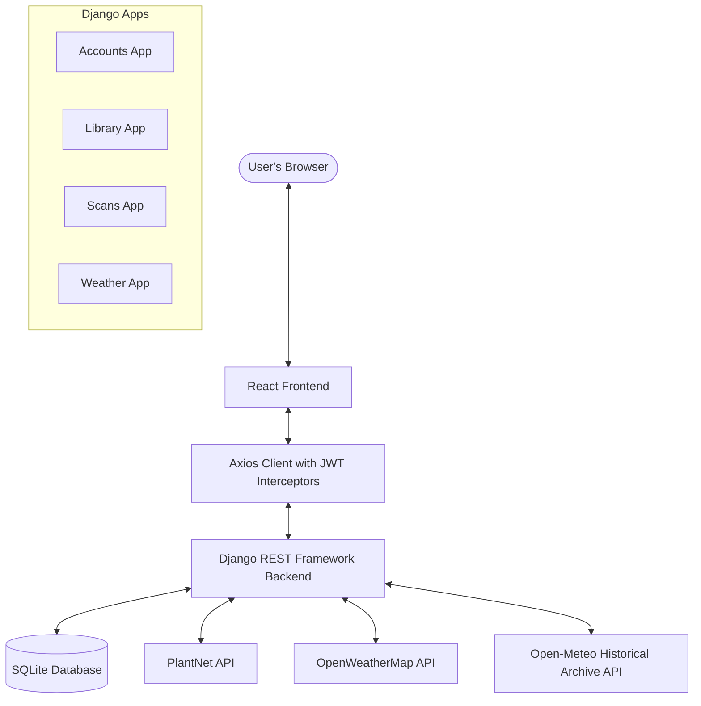

# PlantCare Project Documentation

PlantCare is a Plantix-style plant health web application designed for identifying crop species, matching diseases from a local library catalog, and evaluating crop growth conditions based on real-time and historical weather data.

---

## 1. System Architecture

The application is split into two halves:
1. **Backend**: Python 3.12, Django 5.x, Django REST Framework, and SimpleJWT. SQLite is used as the database.
2. **Frontend**: React 18 (Vite), React Router Dom, Axios, Recharts, and Vanilla CSS with CSS variables for responsive styling and light/dark mode support.

---

## 2. Backend Modules & Database Schema

### A. Accounts Module (`accounts/`)
Extends Django's `AbstractUser` to support user profiles, preferred languages, and theme preferences.

**User Model Fields:**
* `username`: CharField (built-in, unique, login identity)
* `email`: EmailField (built-in)
* `password`: CharField (built-in)
* `phone_number`: CharField(15), null/blank
* `profile_image`: ImageField(upload_to='profiles/'), null/blank
* `location_city`: CharField(100), null/blank
* `latitude`: FloatField, null/blank
* `longitude`: FloatField, null/blank
* `farm_name`: CharField(150), null/blank
* `farm_size_acres`: FloatField, null/blank
* `preferred_language`: CharField(2), choices: `en` (English), `hi` (Hindi), `gu` (Gujarati), default `en`
* `theme_preference`: CharField(5), choices: `light` (Light), `dark` (Dark), default `light`
* `created_at`: DateTimeField(auto_now_add=True)
* `updated_at`: DateTimeField(auto_now=True)

**Endpoints:**
* `POST /api/accounts/register/`: Registers a user. Returns JWT pair (`access`, `refresh`) and user profile details.
* `POST /api/accounts/login/`: Validates credentials. Returns JWT pair and user profile details.
* `POST /api/accounts/login/refresh/`: Refreshes the access token using a refresh token.
* `GET /api/accounts/profile/`: Retrieves the logged-in user's profile details.
* `PATCH /api/accounts/profile/`: Partials update the user's profile details.
* `PATCH /api/accounts/preferences/`: Updates language and theme preference fields. Rejects invalid options with 400.

---

### B. Library Module (`library/`)
Serves as the reference catalog for Crops, Fertilizers, and Diseases.

**Models:**
1. **Crop**:
   * `name`: CharField(100), unique
   * `scientific_name`: CharField(150)
   * `description`: TextField
   * `image`: ImageField(upload_to='crops/')
   * `ideal_temp_min_c`: FloatField
   * `ideal_temp_max_c`: FloatField
   * `ideal_humidity_min`: FloatField
   * `ideal_humidity_max`: FloatField
2. **Fertilizer**:
   * `name`: CharField(100), unique
   * `fertilizer_type`: CharField(10), choices: `organic`, `chemical`, `bio`
   * `description`: TextField
   * `usage_instructions`: TextField
3. **Disease**:
   * `crop`: ForeignKey(Crop, on_delete=CASCADE, related_name='diseases')
   * `name`: CharField(100)
   * `symptoms`: TextField
   * `causes`: TextField
   * `treatment`: TextField
   * `fertilizers_recommended`: ManyToManyField(Fertilizer)
   * *Constraint*: `unique_together` on `('crop', 'name')`

**Endpoints:**
* `GET /api/library/crops/`: Returns list of all crops (ID, name, image).
* `GET /api/library/crops/<id>/`: Returns detail of a crop, including its nested diseases and recommended fertilizers.
* `GET /api/library/diseases/?crop_name=`: Searches for diseases by crop name (case-insensitive search).

---

### C. Scans Module (`scans/`)
Handles uploading plant images, identifying species using the PlantNet API, and diagnosing diseases.

**Model: `ScanHistory`**
* `user`: ForeignKey(User, on_delete=CASCADE, related_name='scans')
* `image`: ImageField(upload_to='scans/%Y/%m/')
* `organ`: CharField(10), choices: `leaf`, `flower`, `fruit`, `bark`, default `leaf`
* `identified_species`: CharField(200)
* `identified_common_name`: CharField(200), null/blank
* `confidence_score`: FloatField (0.0 to 1.0)
* `plantnet_raw_response`: JSONField
* `matched_crop_name`: CharField(100), null/blank (cross-referenced Crop name)
* `disease_identified`: CharField(100), null/blank (matched Disease name)
* `is_healthy`: BooleanField
* `fertilizer_recommendation`: TextField, null/blank
* `latitude`: FloatField, null/blank
* `longitude`: FloatField, null/blank
* `created_at`: DateTimeField(auto_now_add=True)

**Endpoints:**
* `POST /api/scans/upload/`: Uploads image + organ + optional coords. Calls PlantNet, runs identification, matches disease in library, saves, and returns the scan entry.
* `GET /api/scans/history/`: Paginated list of logged-in user's scans (newest first).
* `GET /api/scans/history/<id>/`: Detail of a specific scan. Enforces ownership (404 if accessed by another user).
* `GET /api/scans/stats/`: Returns aggregates: total scans, healthy counts, diseased counts, counts grouped by crop, and counts grouped by month (via `TruncMonth`).

**PlantNet Logic Flow:**
1. Save scan row with image, organ, and geolocation coordinates.
2. Call `PlantNetClient.identify(image, organ)`.
   * On HTTP failure/timeout, raise `PlantNetError` and return `502 Bad Gateway` to the client.
3. Extract top match's species name, common name (first entry), and score.
4. Set `matched_crop_name` to common name (fallback to scientific species name).
5. Search the `Disease` model for any disease matching `matched_crop_name` or species scientific name (case-insensitive).
   * If found: Set `is_healthy = False`, set `disease_identified` to the disease name, and populate `fertilizer_recommendation` (join the names of all recommended fertilizers, or fall back to the disease treatment text if none linked).
   * If not found: Set `is_healthy = True`, leave disease/fertilizer fields blank.
6. Save the scan entry again and return the serialized model.

---

### D. Weather Module (`weather/`)
Integrates weather data and calculates crop growth suitability.

**Endpoints:**
* `GET /api/weather/current/`: Returns current temperature, humidity, wind, and description.
* `GET /api/weather/forecast/`: Returns the 5-day forecast. Aggregates the 3-hourly entries into one daily average.
* `GET /api/weather/past/?days=`: Returns historical weather for the past N days. Fetches from Open-Meteo's Archive API, normalized to the same format as the forecast.
* `GET /api/weather/growth-chance/?crop_id=`: Computes growth suitability for a given crop based on the 5-day forecast.

**Location Resolution:**
For all weather endpoints, resolve coordinates in order:
1. `?lat=&lon=` query parameters (if provided).
2. Saved `latitude` and `longitude` on the user's profile.
3. If neither is available, return `400 Bad Request`.

**Growth Chance Calculation:**
1. Retrieve the selected Crop. If not found, return `404 Not Found`. (If crop_id is missing, return `400`).
2. Fetch the 5-day forecast for the resolved location.
3. Compare the daily average temperature and humidity for each forecast day against the crop's ideal range:
   * Suitability criteria: `crop.ideal_temp_min_c <= day_temp <= crop.ideal_temp_max_c` AND `crop.ideal_humidity_min <= day_humidity <= crop.ideal_humidity_max`.
4. Calculate suitability percentage: `(favorable_days / total_days) * 100`.
5. Return growth chance percentage and a verdict string:
   * `growth_chance >= 70%` -> **Good**
   * `growth_chance >= 40%` -> **Mixed**
   * Else -> **Unfavorable**

---

## 3. Frontend Architecture

The frontend is a React single-page application configured with Vite.

### A. Context & Authentication Flow
* **AuthContext**: Holds the current user profile, access, and refresh tokens in React state (memory only).
  * Requests are signed using an Axios interceptor attaching `Authorization: Bearer <token>`.
  * Response interceptor catches `401 Unauthorized`. If it is the first refresh attempt, it calls `/api/accounts/login/refresh/` using the refresh token. Upon success, it updates the in-memory access token and retries the original request.
  * If refresh fails, it clears credentials and redirects the user to `/login`.
* **LanguageContext**: Manages active language (`en`, `hi`, `gu`) loaded from the user's profile. Surfaces translation strings via a `t("key")` helper. Instantly updates the UI and fires a background PATCH request to `/api/accounts/preferences/`.
* **ThemeContext**: Manages the theme (`light` or `dark`). Persists preference on the backend and toggles a `.dark` class on the root element, setting CSS variables.

### B. User Interface Screens (Human-Made Design)
* **Auth Pages (Login & Register)**: Elegant, glassmorphic login and registration cards with custom input validations.
* **Crop Library Grid**: A searchable, responsive grid showing crops. Tapping a crop opens a detail panel with ideal growing parameters and expandable disease/fertilizer drawers.
* **Scan Upload Panel**: Visual camera/file uploader, organ selector (leaf/flower/fruit/bark), toggle to "use current location" via browser geolocation, and clear loading states with retry handling on 502.
* **Scan Result Card**: Clean visual cards displaying the diagnosed plant, confidence score gauge, healthy vs. diseased badge, symptoms, causes, and recommended treatments.
* **History Dashboard**: A paginated grid/list of previous scans. Tapping an item opens the scan result view. Features charts:
  * **Pie Chart**: Healthy vs. diseased scans.
  * **Bar Chart**: Scans count per crop type.
  * **Line Chart**: Scan frequency trend over months.
* **Weather & Growth Suitability**: Cards showing current weather. Switchable toggles between 7-day past history and 5-day future forecasts. Contains a crop selector that displays a gauge showing the growth chance for that crop under current forecast trends, with a detailed breakdown.
* **Profile Settings**: Forms for updating name, contact info, farm details, location coordinates, and changing language/theme preferences, alongside a logout action.

---

## 4. Test Specifications

### Backend Test suite (70+ Tests Total)
* **Accounts (16 tests)**: Verifies successful registrations, mismatched passwords, duplicate usernames, weak passwords, login checks, token refreshing, auth requirements, partial updates, and language/theme validation.
* **Library (14 tests)**: Tests Crop list/detail auth controls, nested disease structures, search filters, crop uniqueness, delete cascades, and 404 responses.
* **Scans (12 tests)**: Mocks PlantNet API. Checks disease matching, healthy fallbacks, 502 errors, auth checks, user data isolation, and statistics aggregation.
* **Weather (13 tests)**: Mocks OpenWeather/Open-Meteo APIs. Tests location overrides, fallback logic, upstream errors, growth rate calculations, and 400/404 scenarios.
* **Cross-Phase Integration Tests (19 tests)**: Verifies setups, authentications, data sharing, scan matching, and weather coordinate resolutions.

### Frontend Test Suite (30+ Tests Total)
Uses Vitest, React Testing Library, and MSW to mock all network queries.
* **App Shell (6 tests)**: Verifies Axios interceptors, JWT injections, auto-refresh retry behavior, and route guards.
* **Auth (4 tests)**: Checks form submissions, error messages, validation, and token saves in context.
* **Language Switch (4 tests)**: Tests initial render, instant re-renders, and PATCH requests.
* **Theme Switch (3 tests)**: Verifies class updates, persistent settings, and styles.
* **Feature Pages (23 tests)**: Verifies crop grids, search filters, image previews, 502 retry handling, badge renderings, chart data mappings, and settings forms.

---

## 5. Recent Upgrades & Multi-Database ML Dataset Logging

### A. Automatic Environment Variables Auto-Loading
* Environment configurations (variables inside `.env`) are loaded automatically when running any commands or running the server (`python manage.py runserver`, `migrate`, `test`, WSGI, ASGI) via `python-dotenv` integration at the entry points of `manage.py`, `plantcare/wsgi.py`, and `plantcare/asgi.py`. No manual terminal export/sourcing is needed.

### B. Full-Word Language Toggle & Sidebar Stacking
* Language selector toggle switches show full localized words: **English**, **हिन्दी**, and **ગુજરાતી**.
* To prevent layout overflow on narrow viewports/sidebars, the language selection bar and theme selector are stacked vertically within the sidebar's bottom preferences drawer.

### C. Unified Location Resolution & Geocoding Fallback Flow
Both Weather Advisor and Plant Health Scan features resolve geolocation according to this exact priority order:
1. **User Profile City**: Geocodes the user's profile `location_city` using OpenWeather Geocoding API (`OpenWeatherClient.geocode_city()`).
2. **User Profile GPS**: Falls back to user's saved `latitude` and `longitude` fields in their account settings.
3. **Browser Geolocation**: Falls back to the browser's `navigator.geolocation` API.
   * *Weather Advisor view*: If no location is resolved, triggers `trigger_browser_geolocation = True` to run browser geolocation in the frontend and redirect with query parameters.
   * *Scan upload view*: Web-based scan uploads automatically populate coordinates based on this fallback list on successful submission.

### D. Dedicated ML FUTUREDATASET Database
A secondary database file `FUTUREDATASET.db` has been introduced specifically to accumulate high-quality training datasets of agricultural classification inputs and outputs.

**Database Configuration:**
* Key name: `FUTUREDATASET`
* File path: `FUTUREDATASET.db`
* Table name: `FUTUREDATASET`

**Model: `FutureDataset`**
* `username`: CharField (username of the uploader)
* `image_name`: CharField (name of crop scan image)
* `organ`: CharField (leaf, flower, fruit, bark)
* `identified_species`: CharField (scientific name)
* `identified_common_name`: CharField (common name)
* `confidence_score`: FloatField
* `is_healthy`: BooleanField (health label: 0/1)
* `disease_identified`: CharField
* `fertilizer_recommendation`: TextField
* `latitude` / `longitude`: FloatField (geolocational tag)
* `created_at`: DateTimeField

**Upload Logging:**
Whenever any scan is successfully completed via the Web UI (`plantcare/views.py`) or REST API (`scans/views.py`), a replica record of the details and output predictions is automatically stored in the `FUTUREDATASET` database via `FutureDataset.objects.using('FUTUREDATASET').create(...)`.

**Deletion Isolation (Intact Training Data):**
* The `FutureDataset` model is intentionally decoupled from the core Django user database table. It logs the uploader's `username` as a plain text string instead of using a `ForeignKey`.
* When a user deletes their account, Django's default CASCADE rules delete the user's login profile and `ScanHistory` records from the default database.
* However, the scan classification record stored in the `FUTUREDATASET` database remains completely intact, ensuring that valuable training logs are never lost.

