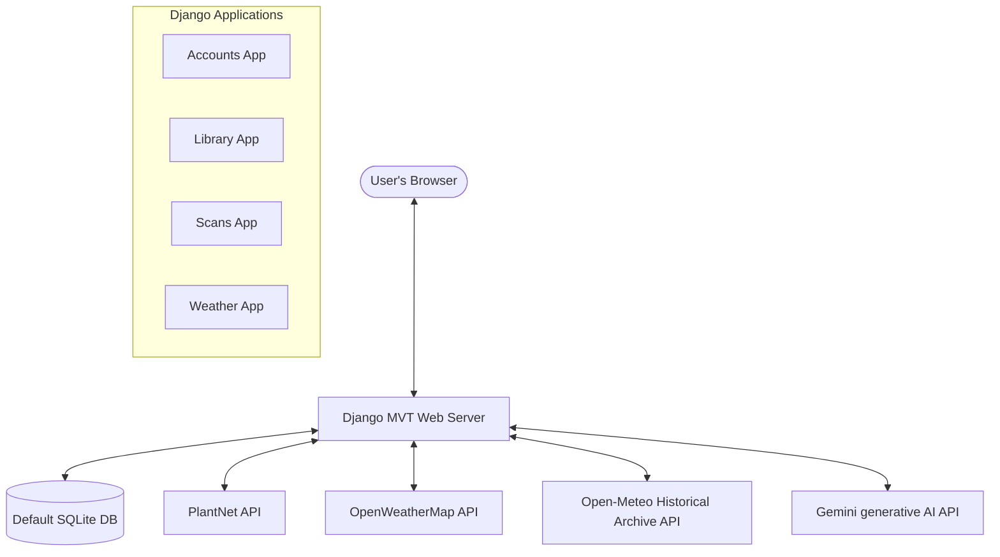

# PlantCare AI - Intelligent Plant Health & Agricultural Support Portal

PlantCare AI is a comprehensive plant health diagnostic and agricultural advisory web application designed to support farmers and agricultural professionals. It offers image-based plant disease classification, real-time geolocated weather analysis, a structured crop details reference library, a customized plant recovery journey tracking system, and a dynamic Gemini-powered AI chatbot assistant.

---

## 1. System Architecture

The application is built on a robust Django architecture integrating external services for real-time diagnostics and environmental forecasting:



---

## 2. Core Functional Modules

### A. Plant Health Diagnostics (`scans/`)
* **Leaf Scan Uploads**: Farmers can upload photos of plant leaves, flowers, fruits, or bark.
* **PlantNet Identification API**: Interacts with the PlantNet API to classify plant species and calculate confidence metrics.
* **Local Disease Matching**: Cross-references identified species with our internal `Disease` database.
  * **Healthy Plants**: Flags the plant as healthy if no local matching disease is found.
  * **Diseased Plants**: Returns detailed symptoms, causes, organic treatments, chemical treatments, and recommended fertilizers.
* **PDF Diagnostic Exports**: Generates downloadable print-ready PDF reports of individual scan diagnostics.

### B. Agricultural AI Chatbot Assistant (`assistant/`)
* **Multi-Step Survey Stepper**: A clean, B&W wizard stepper slider that helps farmers specify context (Crop, Soil Type, Growth Stage, and Weather) one question at a time.
* **Dynamic Selected-Crop Context Badges**: Visual indicator boxes that dynamically update on all steps to reflect the chosen crop from Step 1.
* **Contextual Gemini AI Advisor**: Invokes Google's Gemini API, providing it with structured context (crop, soil, stage, weather) and history to deliver tailored agricultural recommendations.
* **Dynamic Multilingual Chatting**: Fully converses in the user's preferred language (English, Gujarati, or Hindi) with automatic prompt translations.

### C. Plant Recovery Tracker (`recovery/`)
* **Custom Recovery Journeys**: Farmers can register sick crops to start a structured plant recovery journey.
* **Weekly Check-Ins**: Log weekly progress, upload check-in photos, describe symptom changes, monitor pest activity, and update estimated recovery progress.
* **Dynamic Care Directives**: The system dynamically generates tailored care advices based on check-in inputs.
* **Journey PDF Exports**: Generates print-ready PDF summaries of the complete weekly recovery logs.

### D. Weather Advisor & Crop Suitability (`weather/`)
* **Weather Indicators**: Displays current conditions and historical weather trends (past 7 days) alongside future forecasts (5 days).
* **Crop Growth Suitability Gauge**: Evaluates the 5-day forecast temperature and humidity against the crop's ideal parameters to generate a growth chance percentage and suitability verdict (**Good**, **Mixed**, or **Unfavorable**).

### E. Reference Crop Details Library (`library/`)
* **Crops Catalog**: A fast, grid-based directory containing crops (simplified to names only for quick browsing).
* **Disease & Symptom Search**: Search bar to query diseases, symptoms, or treatment protocols.
* **Part-wise Disease Grouping**: Selected crops display details, ideal ranges, optimal soil requirements, organic control guides, and nested diseases grouped logically by affected part (Leaf, Fruit, Stem/Branch, Root).

---

## 3. Database Schema & Secondary ML Database

The database layer consists of two distinct databases:

### 1. Default Database (`db.sqlite3`)
Handles user accounts, session states, profile settings, search logs, scan history records, and recovery tracker sessions.
* **User**: Custom user model supporting GPS coordinates, preferred language (`en`/`hi`/`gu`), theme preferences (`light`/`dark`), and farm parameters.
* **SearchHistory**: Stores search strings for crops and diseases to compile user interest analytics.
* **EmailOTP**: Handles registration and password reset verification codes.
* **RecoveryTracker & RecoveryCheckIn**: Manages weekly check-in logs and images.

## 4. Performance & UX Optimizations

1. **Automatic Debounced Geocoding**:
   - The blocking "Resolve GPS via API" buttons have been removed from the Registration, Profile, and Weather pages.
   - Geocoding is now triggered **automatically** in the background using debounced `oninput` (600ms) and `onchange` events on the City input, silently populating coordinates without page freezes or manual clicks.
2. **Database Query Acceleration**:
   - Database indexes (`db_index=True`) have been added to frequently searched and sorted fields (`Disease.name`, `Disease.affected_part`, `SearchHistory.created_at`, `RecoveryTracker.status`, `RecoveryTracker.created_at`, `RecoveryCheckIn.week_number`, `ScanHistory.created_at`).
3. **Robust Case-Insensitive Translation**:
   - Crop name translation supports exact lookup, case-insensitive match (e.g. `chilli` -> `Chilli`), and substring matching (e.g. `Chili Pepper` -> `Chilli`).
   - Integrates dynamic Gemini API translation fallbacks for unknown crop names with memory caching.
4. **Vibrant Agriculture & Premium Dark Themes**:
   - Uses CSS custom variables for seamless theme toggles. Toggling language refreshes the translation database instantly.

---

## 5. Local Setup & Execution

### Prerequisites
* Python 3.11+
* SQLite3

### 1. Installation
Clone the repository, initialize a virtual environment, and install dependencies:
```bash
# Initialize virtual environment
python -m venv .venv
source .venv/Scripts/activate  # On Windows

# Install packages
pip install -r requirements.txt
```

### 2. Environment Variables (`.env`)
Create a `.env` file in the project root:
```env
SECRET_KEY=your-django-secret-key
DEBUG=True
ALLOWED_HOSTS=localhost,127.0.0.1
PLANTNET_API_KEY=your-plantnet-api-key
PLANTNET_PROJECT=all
OPENWEATHER_API_KEY=your-openweathermap-api-key
EMAIL_HOST_USER=your-email@gmail.com
EMAIL_HOST_PASSWORD=your-app-password
GEMINI_API_KEY=your-gemini-api-key
```

### 3. Migrations & Database Setup
Initialize the database files and apply schema migrations:
```bash
# Run migrations
python manage.py migrate

# Seed catalog database with 100 crops and diseases
python manage.py seed_crops
```

### 4. Running the Project
Launch the Django local development server:
```bash
python manage.py runserver
```
Visit the web portal at `http://127.0.0.1:8000/`.

---

## 6. Testing

Run the Django automated unit and integration tests:
```bash
python manage.py test
```
The test suite validates accounts, library reference queries, geocoding priorities, mocked weather clients, and recovery workflows.
